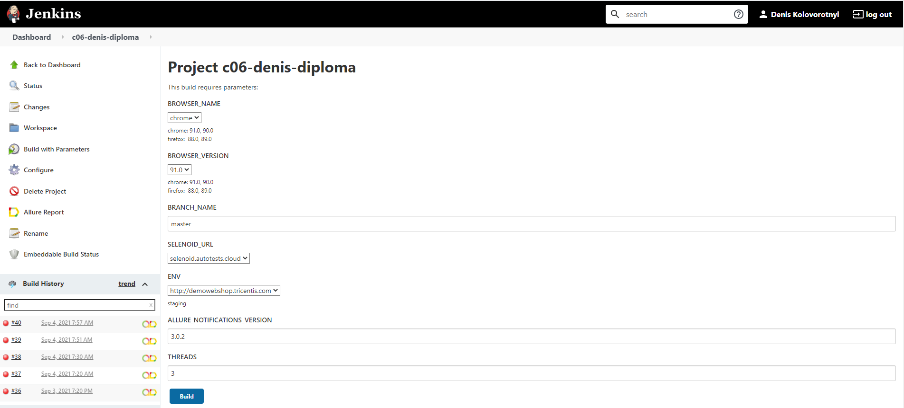
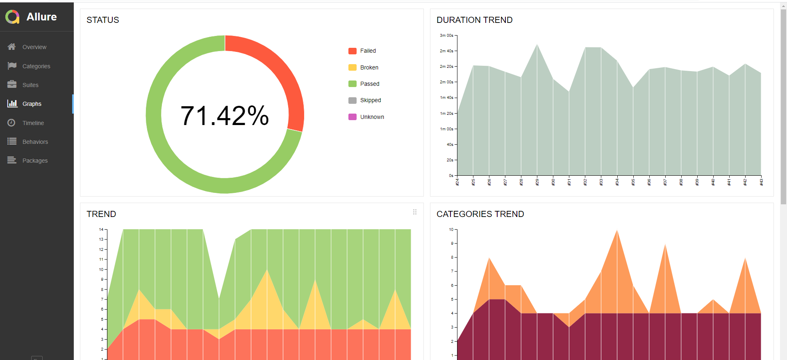
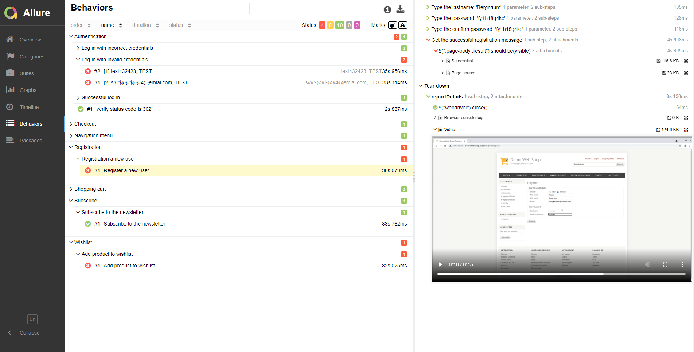
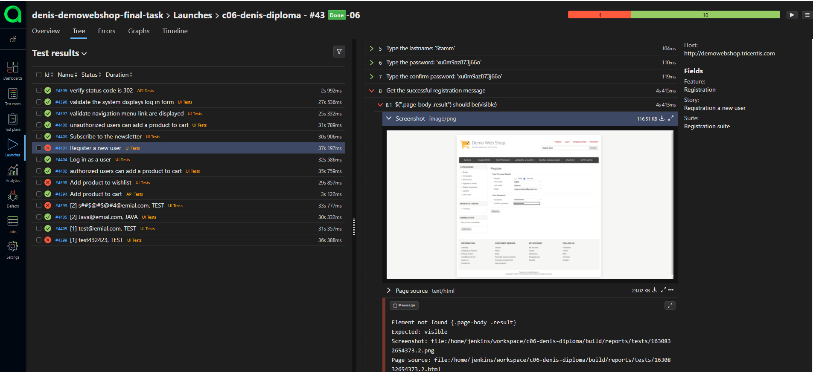
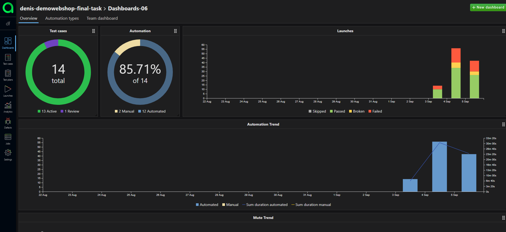
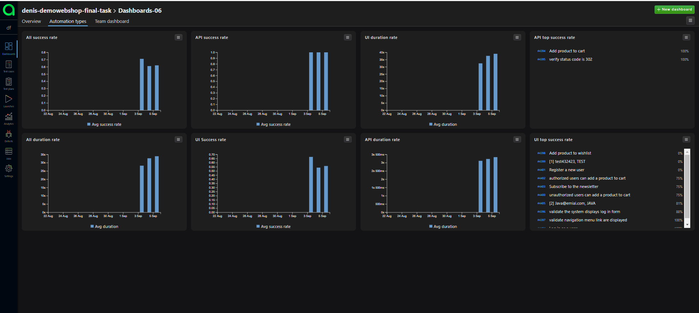
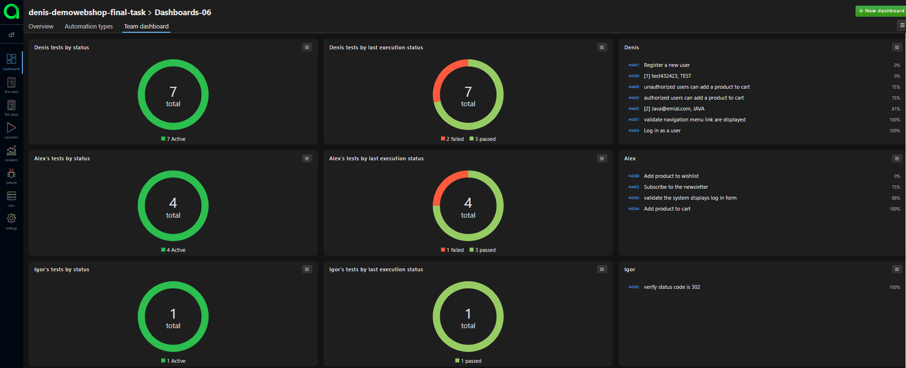
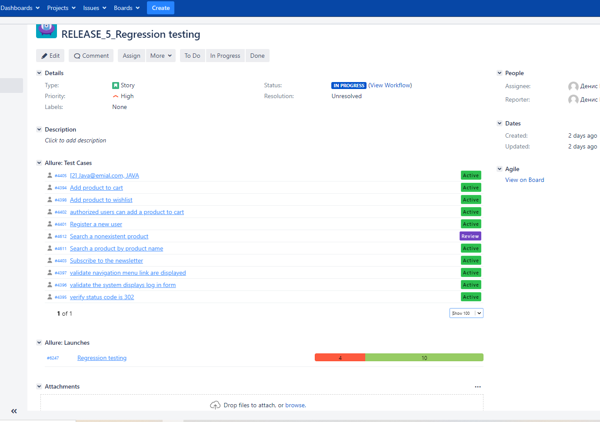
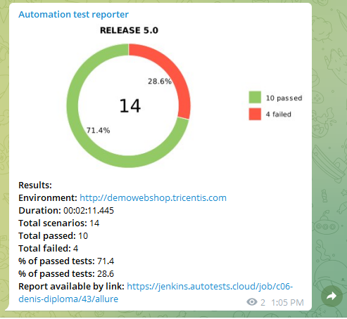

# Test automation framework for [Demo Web Shop](http://demowebshop.tricentis.com) application

## Description

The test automation framework has been developed in [Java](https://go.java/) using a modern technology stack. It contains both API and UI tests. 

There are several tools are used:
* [Gradle](https://gradle.org) is a project build management system
* [JUnit 5](https://junit.org/junit5/) is used as a test runner
* [Selenide](https://selenide.org) is the main tool for UI testing
* [REST-Assured](https://rest-assured.io) is the tool for API testing
* [Jenkins](https://www.jenkins.io/) is a continuous integration system to launch the tests
* [Selenoid](https://aerokube.com/selenoid/) is used to run browsers in [Docker containers](https://www.docker.com/resources/what-container)  for UI tests
* [Jira](https://www.atlassian.com/software/jira) is an issue tracking system
* [Allure Report](http://allure.qatools.ru) and [Allure TestOps](https://docs.qameta.io/allure-testops/) are used to visualize test results
* [Telegram Bot](https://core.telegram.org/bots) is a custom bot using to notify about the test results

## UI Tests

:heavy_check_mark: UI Register a new user    
:heavy_check_mark: UI login test    
:heavy_check_mark: UI login test with incorrect credentials    
:heavy_check_mark: Validate authorized users can add a product to cart  
:heavy_check_mark: Validate unauthorized users can add a product to cart   
:heavy_check_mark: Validate the system displays the login form if an unauthorized user want to check out the order  
:heavy_check_mark: Subscribe to the newsletter  <br/>
:heavy_check_mark: Add product to wishlist with UI <br/>
:heavy_check_mark: Search a product by product name <br/>
:heavy_check_mark: Search a nonexistent product <br/>

## API Tests

:heavy_check_mark: Send e-mail from product page with API    
:heavy_check_mark: Add product to wishlist with API    
:heavy_check_mark: Add product to cart with API

## Technology Stack

| <a href="https://www.jetbrains.com/idea/"></a> | <a href="https://www.jetbrains.com/idea/"></a> |<a href="https://www.jetbrains.com/idea/"></a> | <a href="https://www.jetbrains.com/idea/"></a> | <a href="https://www.jetbrains.com/idea/"></a> |<a href="https://www.jetbrains.com/idea/"></a> |
| :---------: | :---------: | :---------: | :---------: | :---------: | :---------: |
| IDEA | Java | Junit 5 | Rest Assured | Gradle | Selenide |

| <a href="https://www.jetbrains.com/idea/"></a> | <a href="https://www.jetbrains.com/idea/"></a> |<a href="https://www.jetbrains.com/idea/"></a> | <a href="https://www.jetbrains.com/idea/"></a> | <a href="https://www.jetbrains.com/idea/"></a> |<a href="https://www.jetbrains.com/idea/"></a> |
| :---------: | :---------: | :---------: | :---------: | :---------: | :---------: |
| Selenoid | Allure | Allure TO | Jenkins | Github | Jira |

## Launch the tests

### To run the tests locally (default):

```
gradle clean test 
```
### To run the tests remotely:

```
clean test 
-Dbrowser={BROWSER_NAME} 
-DbrowserVersion={BROWSER_VERSION} 
-DremoteDriverUrl={REMOTE_DRIVER_URL} 
-DvideoStorage={VIDEO_STORAGE_URL} 
-DwebUrl={WEB_URL}
-DapiUrl={API_URL}
-Dthreads={THREADS}
```

### Video sample with passing test case:


### - Jenkins job


### - Allure report



### - Allure Test Ops


### - Allure Test analytics




### - Integration with Jira


### - Telegram notification
